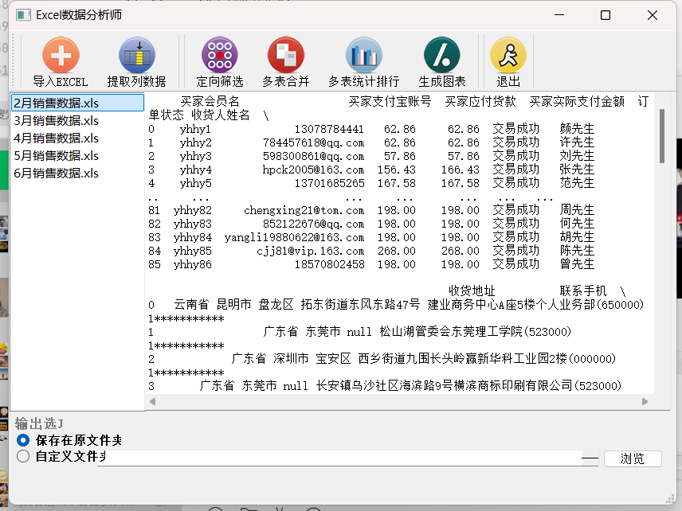

# EXCEL分析工具

## 需求分析
主要是帮助指定格式的excel进行特定分析

减少直接打开excel的其他因素影响以及用户不需要做一些excel的特定操作，通过按钮就可以减少复杂性

## 使用说明
* **导入Excel**：单击工具栏中的“导入Excel”按钮，打开文件对话框选择文件夹，如XS1 文件夹，系统将遍历该文件夹中的*.xls 文件，并且将文件添加到列表区
* **提取列数据**：单击工具栏中的“提取列数据”按钮，提取买家会员名、收货人姓名、联系手机和宝贝标题。提取后的数据将保存在程序所在目录下的mycell.xls 文件中。
* **定向筛选**：单击工具栏中的“定向筛选”按钮，筛选“零基础学Python”的用户信息。筛选后的数据将保存在程序所在目录下的mycell.xls 文件中。
* **多表合并**：单击工具栏中的“多表合并”按钮，将列表中的 Excel 表全部合并成一个表，合并结果将保存在程序所在目录下的 mycell.xls 文件中。
* **多表统计排行**：单击工具栏中的“多表统计排行”按钮，按“宝贝标题”进行分组统计数量并进行排序，效果如图5所示。统计排行结果将保存在程序所在目录下的mycell.xls 文件中。
* **生成图表**：该功能主要分析产品的贡献度。单击工具栏中的“生成图表”按钮，将全彩系列图书 2018 年上半年收入占 80%的产品以图表形式展示

## 使用展示

